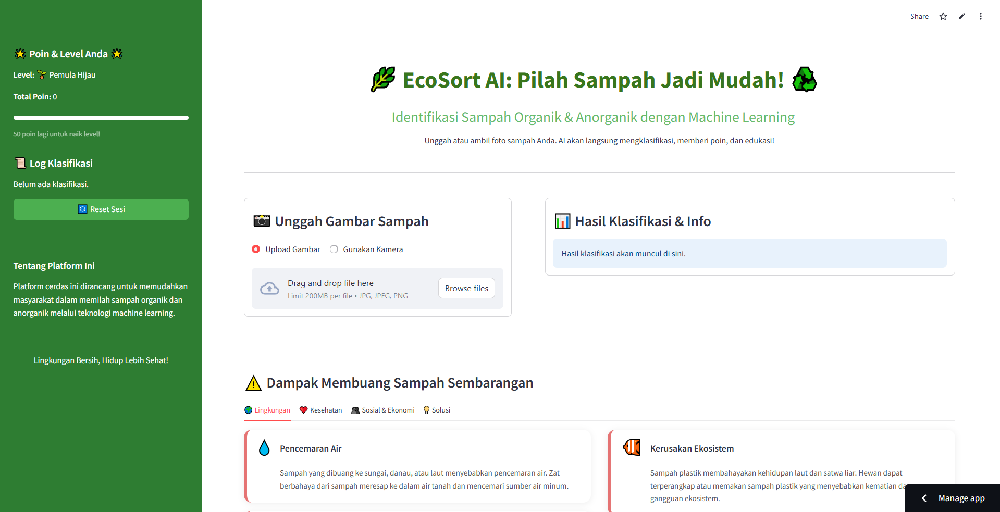

# EcoSort AI: Klasifikasi Sampah Organik & Anorganik 🌿

  

**EcoSort AI** adalah aplikasi web cerdas yang dirancang untuk membantu masyarakat mengidentifikasi dan memilah sampah organik dan anorganik dengan mudah menggunakan teknologi Machine Learning. Proyek ini dikembangkan sebagai bagian dari program pelatihan Coding Camp 2025 by DBS Foundation.

> **Tujuan Utama:** Menjadikan proses pemilahan sampah lebih mudah, edukatif, dan memotivasi bagi semua kalangan.

---

## 🚀 Live Demo

Aplikasi dapat diakses langsung melalui tautan di bawah ini:

  

  

---

## 🎯 Latar Belakang

Pengelolaan sampah di Indonesia masih menjadi tantangan besar. Salah satu akar masalahnya adalah kesulitan masyarakat di tingkat rumah tangga untuk memilah sampah organik dan anorganik. Solusi teknologi yang ada seringkali tidak praktis, mahal, atau kurang memberikan edukasi. EcoSort AI hadir untuk mengisi kesenjangan ini dengan menyediakan alat yang ringan, mudah diakses, dan interaktif.

---

## ✨ Fitur Utama

-   **🤖 Klasifikasi AI Instan:** Unggah atau ambil foto sampah dan dapatkan hasil klasifikasi organik/anorganik dalam hitungan detik.
-   **🌟 Sistem Gamifikasi:** Kumpulkan poin untuk setiap klasifikasi yang benar dan naikkan level Anda untuk membangun kebiasaan positif.
-   **💡 Edukasi Kontekstual:** Dapatkan tips penanganan praktis langsung setelah klasifikasi dan pelajari dampak sampah melalui konten edukasi yang mudah dipahami.
-   **📊 Log Aktivitas:** Pantau riwayat klasifikasi Anda untuk melihat progres dan kontribusi Anda.

---

## 🚀 Teknologi yang Digunakan

| Kategori                  | Teknologi                                                              |
| ------------------------- | ---------------------------------------------------------------------- |
| **Frontend** | `Streamlit`, `HTML`, `CSS`                                             |
| **Backend & ML** | `Python`, `TensorFlow`, `Keras`                                        |
| **Pemrosesan Data/Gambar**| `NumPy`, `Pillow (PIL)`                                                |

---

## 🧠 Detail Model Machine Learning

-   **Arsitektur:** Kami menggunakan **CNN (Convolutional Neural Network) kustom** berbasis **Depthwise Separable Convolution**. Arsitektur ini dipilih karena sangat ringan dan efisien, sehingga ideal untuk aplikasi web.
-   **Dataset:** Model ini dilatih menggunakan dataset publik [Waste Classification Data](https://www.kaggle.com/datasets/techsash/waste-classification-data) dari Kaggle.
-   **Performa:** Model berhasil mencapai **akurasi 91%** pada data pengujian.

---

## 👥 Tim Kami (CC25-CR438)

Proyek ini adalah hasil kolaborasi dari:

| Nama                   | Student ID     | Universitas                             | Peran Utama                           |
| ---------------------- | -------------- | --------------------------------------- | ------------------------------------- |
| **Muhammad Tsaqif** | `MC004D5Y2062` | Institut Teknologi Sepuluh Nopember   | Core Model Engineer                   |
| **Putu Yoga Suartana** | `MC298D5Y2265` | Universitas Pendidikan Ganesha        | ML & Deployment Developer             |
| **Syakib Binnur** | `MC288D5Y2465` | Universitas Pamulang                    | UX & Education Specialist             |

---

## 🙏 Ucapan Terima Kasih

Terima kasih kepada tim **Coding Camp 2025 by DBS Foundation** dan **Dicoding Indonesia** atas kesempatan, bimbingan, dan kurikulum yang luar biasa selama program berlangsung.
